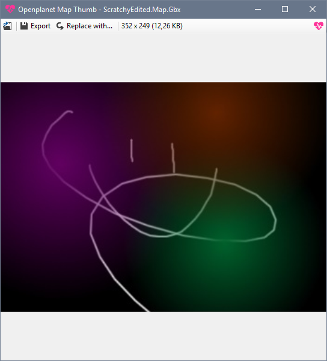

# Map Thumbnail

Tool for exporting or modifying thumbnails from maps in Maniaplanet. Part of the Openplanet toolchain.

Download a precompiled version here: [Releases](https://github.com/openplanet-nl/map-thumb/releases)

## License

    Maniaplanet map thumbnail exporter and modifier.
    Copyright (C) 2018  Melissa Geels

    This program is free software; you can redistribute it and/or
    modify it under the terms of the GNU General Public License
    as published by the Free Software Foundation; either version 2
    of the License, or (at your option) any later version.

    This program is distributed in the hope that it will be useful,
    but WITHOUT ANY WARRANTY; without even the implied warranty of
    MERCHANTABILITY or FITNESS FOR A PARTICULAR PURPOSE.  See the
    GNU General Public License for more details.

    You should have received a copy of the GNU General Public License
    along with this program; if not, write to the Free Software
    Foundation, Inc., 51 Franklin Street, Fifth Floor, Boston, MA  02110-1301, USA.
